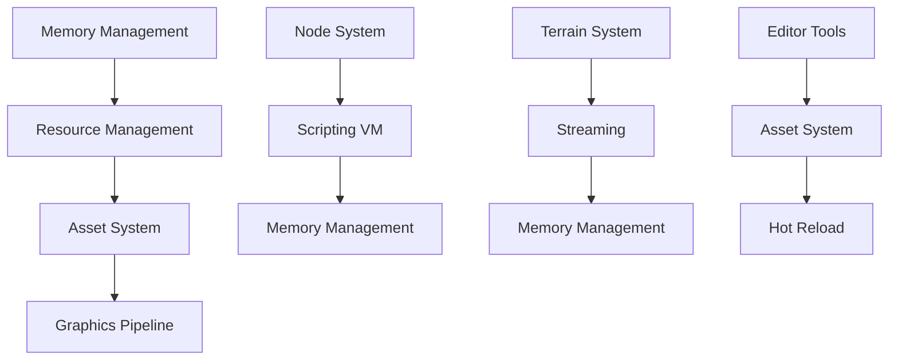
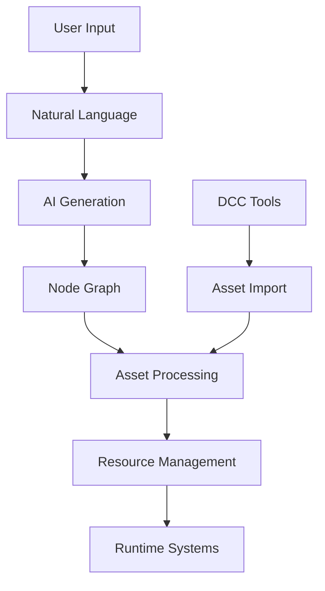
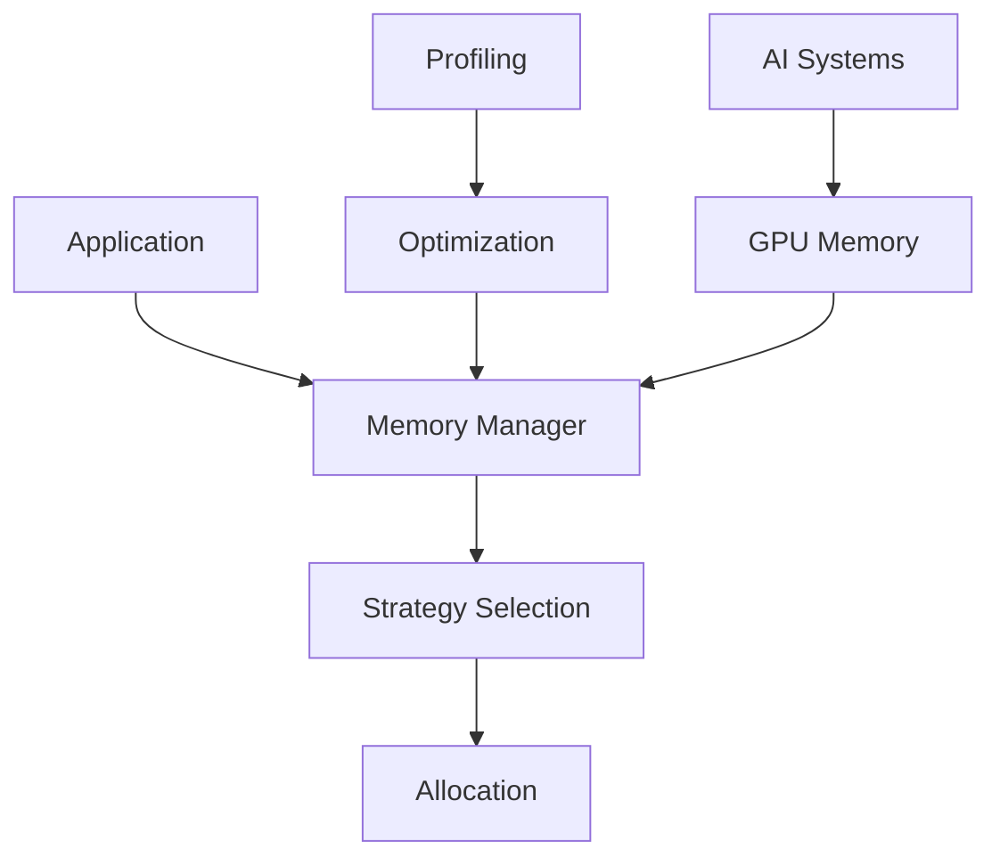

# Engine Folder Structure Documentation

## System Overview

### Key System Relationships

## Core Engine Folders

### Memory Management
Core memory management infrastructure handling all allocation strategies.

- `Engine/Source/Core/Memory/` - Core memory management systems
  - Handles memory allocation, deallocation, and tracking
  - Implements custom allocators and memory pools
  - Manages memory budgets and pressure handling
- `Engine/Source/Core/Memory/Debug/` - Memory debugging utilities
  - Memory leak detection and reporting
  - Allocation tracking and profiling
  - Memory corruption detection
- `Engine/Source/Core/Memory/GPU/` - GPU memory management
- `Engine/Source/Core/Memory/Management/` - Memory management strategies
- `Engine/Source/Core/Memory/Management/Strategies/` - Specific allocation strategies
- `Engine/Source/Core/Memory/NUMA/` - NUMA-aware memory management
- `Engine/Source/Core/Memory/Profiling/` - Memory profiling tools
- `Engine/Source/Core/Memory/Threading/` - Thread-safe memory operations
- `Engine/Source/Core/Memory/Types/` - Memory type definitions
- `Engine/Source/Core/Memory/Virtualization/` - Virtual memory management

### Asset Management
- `Engine/Source/Core/Assets/` - Asset management system
- `Engine/Source/Core/Assets/HotReload/` - Hot reloading functionality

### Core Systems
- `Engine/Source/Core/Collaboration/` - Multi-user collaboration features
- `Engine/Source/Core/Data/` - Data management and structures
- `Engine/Source/Core/Debug/Visualization/` - Debug visualization tools
- `Engine/Source/Core/Plugin/` - Plugin system
- `Engine/Source/Core/Profiling/` - Performance profiling
- `Engine/Source/Core/Tasks/` - Task management system

### Graphics & Terrain
- `Engine/Source/Core/Graphics/Meshlet/` - Meshlet processing
- `Engine/Source/Core/Graphics/RenderAPI/` - Rendering API abstraction
- `Engine/Source/Core/Terrain/Rendering/` - Terrain rendering
- `Engine/Source/Core/Terrain/Streaming/` - Terrain streaming system

### Rendering Pipeline
- `Engine/Source/Core/Graphics/Pipeline/` - Render pipeline management
- `Engine/Source/Core/Graphics/PostProcess/` - Post-processing effects
- `Engine/Source/Core/Graphics/Materials/` - Material system
- `Engine/Source/Core/Graphics/Lighting/` - Lighting and shadows

### Physics & Animation
- `Engine/Source/Core/Physics/` - Physics simulation
- `Engine/Source/Core/Animation/` - Animation system
- `Engine/Source/Core/Animation/Rigging/` - Character rigging
- `Engine/Source/Core/Physics/Collision/` - Collision detection

### Scene Management
- `Engine/Source/Core/Scene/Graph/` - Scene graph management
- `Engine/Source/Core/Scene/Culling/` - Visibility culling
- `Engine/Source/Core/Scene/Serialization/` - Scene saving/loading
- `Engine/Source/Core/Scene/Description/` - Scene description system

### AI & Navigation
- `Engine/Source/Core/AI/PathFinding/` - Path finding systems
- `Engine/Source/Core/AI/Behavior/` - AI behavior trees
- `Engine/Source/Core/Navigation/` - Navigation mesh generation
- `Engine/Source/Core/Navigation/Streaming/` - Navigation data streaming

### Audio
- `Engine/Source/Core/Audio/` - Audio engine
- `Engine/Source/Core/Audio/Streaming/` - Audio streaming
- `Engine/Source/Core/Audio/Spatializer/` - 3D audio
- `Engine/Source/Core/Audio/Effects/` - Audio effects

### Tools & Editor
- `Engine/Source/Editor/Core/` - Editor core functionality
- `Engine/Source/Tools/MemoryVisualizer/` - Memory visualization tools
- `Engine/Source/Tools/MaterialEditor/` - Material editing
- `Engine/Source/Tools/TerrainEditor/` - Terrain editing
- `Engine/Source/Tools/ShaderEditor/` - Shader development
- `Engine/Source/Tools/AssetProcessor/` - Asset processing pipeline
- `Engine/Source/Tools/SceneEditor/` - Scene editing

### Documentation
- `Engine/Docs/DeveloperGuide/RoadmapChat/` - Development roadmap and documentation
- `Engine/Docs/DeveloperGuide/SystemArchitecture/` - System architecture documentation
- `Engine/Docs/API/` - API documentation
- `Engine/Docs/Tutorials/` - Developer tutorials

### Shaders
- `Engine/Shaders/Terrain/` - Terrain-specific shaders
- `Engine/Shaders/Memory/` - Memory-related shaders
- `Engine/Shaders/Debug/` - Debug visualization shaders
- `Engine/Shaders/PostProcess/` - Post-processing shaders
- `Engine/Shaders/Materials/` - Material shaders

### Build & Development
- `Engine/Source/Build/` - Build system
- `Engine/Source/Build/Automation/` - Build automation
- `Engine/Source/Build/Dependencies/` - Third-party management
- `Engine/Source/Build/Testing/` - Test framework

### Networking & Multiplayer
- `Engine/Source/Core/Network/` - Core networking system
- `Engine/Source/Core/Network/Transport/` - Transport layer protocols
- `Engine/Source/Core/Network/Replication/` - State replication
- `Engine/Source/Core/Network/Prediction/` - Client-side prediction
- `Engine/Source/Core/Network/Security/` - Network security

### Scripting & Node System
- `Engine/Source/Core/Scripting/VM/` - Script virtual machine
- `Engine/Source/Core/Scripting/Bindings/` - Language bindings
- `Engine/Source/Core/Scripting/Nodes/` - Node graph system
- `Engine/Source/Core/Scripting/Debug/` - Script debugging tools
- `Engine/Source/Core/Scripting/HotReload/` - Script hot reloading

### UI & Input
- `Engine/Source/Core/UI/Framework/` - UI framework
- `Engine/Source/Core/UI/Widgets/` - Common widgets
- `Engine/Source/Core/UI/Animation/` - UI animations
- `Engine/Source/Core/Input/Devices/` - Input device support
- `Engine/Source/Core/Input/Mapping/` - Input mapping system

### Resource Management
- `Engine/Source/Core/Resources/Cache/` - Resource caching
- `Engine/Source/Core/Resources/Streaming/` - Resource streaming
- `Engine/Source/Core/Resources/Compression/` - Asset compression
- `Engine/Source/Core/Resources/Packaging/` - Content packaging
- `Engine/Source/Core/Resources/Version/` - Version control integration

### Platform & Hardware
- `Engine/Source/Core/Platform/Windows/` - Windows-specific code
- `Engine/Source/Core/Platform/Linux/` - Linux-specific code
- `Engine/Source/Core/Platform/Mobile/` - Mobile platform support
- `Engine/Source/Core/Hardware/GPU/` - GPU capabilities
- `Engine/Source/Core/Hardware/CPU/` - CPU optimization 

### AI-Powered Content Creation
- `Engine/Source/Core/AI/Generation/` - AI content generation
  - Image generation pipeline integration
  - Procedural content creation
  - Natural language processing for content description
- `Engine/Source/Core/AI/Pipeline/` - AI processing pipeline
  - Model loading and management
  - Inference optimization
  - GPU acceleration for AI tasks
- `Engine/Source/Core/AI/Training/` - Training infrastructure
  - Training data management
  - Model fine-tuning capabilities
  - Training progress monitoring

### Node Graph System
- `Engine/Source/Core/Nodes/Graph/` - Core node graph system
  - Visual programming framework
  - Node execution engine
  - Graph serialization/deserialization
- `Engine/Source/Core/Nodes/Types/` - Node type definitions
  - Standard node library
  - Custom node framework
  - Node validation system
- `Engine/Source/Core/Nodes/Execution/` - Node execution
  - Graph evaluation engine
  - Parallel execution support
  - Hot-reload capability

### Integration Systems
- `Engine/Source/Core/Integration/DCC/` - DCC tool integration
  - Blender integration
  - Maya/3ds Max bridges
  - Substance integration
- `Engine/Source/Core/Integration/AI/` - AI service integration
  - Image generation API connections
  - Language model integration
  - Training service connections

## System Interactions

### Content Creation Flow

### Memory Management Flow
