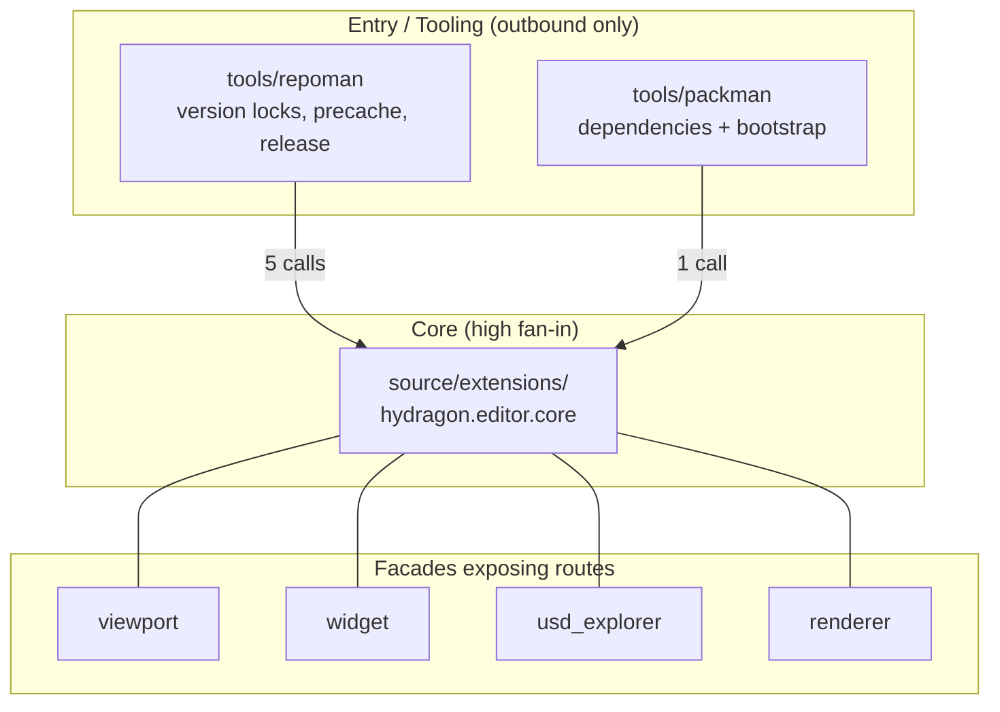

### What is the Hydragon Engine and how does it fit into the game engine ecosystem?

If we had to define the **Hydragon Engine** in a single technical sentence:
> **Hydragon is a next-generation, simulation-oriented game engine that transforms NVIDIA Omniverse Kit and OpenUSD into a real-time gameplay platform, eliminating the historical barrier between content creation tools (DCC), GPU-based physics simulation, and interactive runtimes.**

It is not "just another game engine" trying to reinvent what Unity or Godot already do. Hydragon starts from a fundamentally different premise, which can be understood through the following pillars:

---

### 1. The Fundamental Philosophy: The Traditional Engine Paradox
In established engines like **Unreal Engine 5**, **Unity**, and **Godot**:
* Scene formats and assets are proprietary (`.uasset`, `.prefab`, `.tscn`).
* The art workflow is destructive and unidirectional: the artist models in Blender/Houdini/Maya and exports to FBX/glTF; the engine then re-imports the file, converts it to its own internal buffers, rebuilds materials, and reconfigures collisions. If something changes in the original model, the entire cycle must be repeated.
* The entire hierarchy is based on a closed, monolithic *Scene Graph*, where game code runs tightly coupled to an ecosystem built 15 to 25 years ago.

**How ​​Hydragon breaks this mold:**
* **OpenUSD as a First-Class Citizen (Zero-Loss Pipeline)**:
In Hydragon, there is no "importing into a proprietary format." The game scene **is** an OpenUSD stage. Composition layers (LIVRPS: *Local, Inherits, VariantSets, References, Payloads, Specializes*) allow art, audio, physics, and gameplay logic to coexist non-destructively. An artist can modify a mesh or material in Blender/Maya using Live-Sync, and Hydragon reflects this in gameplay instantly.
* **Component-Driven via USD API Schemas (True ECS)**:
Instead of creating parallel structures in memory, game components are **OpenUSD Custom API Schemas** (`HydragonActorAPI`, `HydragonPlayerControllerAPI`, `HydragonChaserAIAPI`, `HydragonFollowCameraAPI`). Each Prim is an Entity; each applied Schema is a Component; and the Python/C++ Controllers are the pure Systems that iterate over them.

---

### 2. Direct Hardware and GPU Access (NVIDIA Warp + PhysX 5 + Fabric)
In traditional engines:
* Physics and massive particle systems require heavy tools or decoupled custom shaders (like Niagara in UE5 or Compute Shaders in Unity), often involving serialization and data marshaling overhead between CPU and GPU.

**In Hydragon:**
* It was designed from the core for the modern GPU era. As we have just established regarding the VFX system:
- We use **NVIDIA Warp** to compile JIT kernels at runtime directly into CUDA threads.
- We use **OpenUSD PointInstancer and Points** to update tens of thousands of instances or particles with **a single array call per frame**, without generating garbage collector overhead.
- Physics is powered by **NVIDIA PhysX 5 with GPU acceleration**, ensuring continuous collisions and dynamics without empirical approximations.

---

### 3. Direct Comparison with Other Engines

| Aspect | Unreal Engine 5 | Unity | Godot | **Hydragon Engine** |
| :--- | :--- | :--- | :--- | :--- |
| **Data Pipeline** | Proprietary (`.uasset`, `.umap`) | Proprietary (`.asset`, `.unity`) | Proprietary (`.tscn`, `.tres`) | **Open and Universal (Native OpenUSD)** |
| **Shading & Materials** | UE5 proprietary Material Graph | Unity proprietary Shader Graph | Proprietary Shading Language | **Universal MDL (Material Definition Language) and MaterialX** |
| **Base Renderer** | Lumen / Nanite (Hybrid Raster) | URP / HDRP (Raster with optional DXR) | Forward+ / Mobile (Raster) | **Omniverse RTX (Path Tracing and Native Real-Time Ray Tracing)** |
| **Parallelism & Compute** | C++ / Niagara GPU compute | C# / DOTS Job System / Compute | GDScript / C++ / Compute | **NVIDIA Warp (JIT Python-to-CUDA) + USDRT/Fabric** |
| **Market Focus** | AAA Games, Virtual Cinema | Mobile, 2D/3D Games, XR | Indie Games, Desktop, Web | **Advanced Simulations, Digital Twins, Hyper-Realistic & Interactive Games** |
| **Extensibility** | Complex, compiled C++ plugins | C# Packages, Assembly Definition | GDExtension C++ / Modules | **Modular and reactive Omniverse Kit Extensions (Python/C++)** |

---

### 4. Hydragon's Identity
Hydragon represents the convergence of:
1. **The rigor of engineering and robotics simulation** (PhysX 5, ISAAC Sim, Warp).
2. **The interoperability of the film and VFX industries** (Pixar OpenUSD, MDL, Hydra Render Delegates).
3. **The responsiveness and "game-feel" of an interactive game engine** (platforming controls, responsive cameras, triggers, positional audio, HUD, and tactical AI).

It was not designed to compete with engines focused on running on mobile devices or low-end consumption hardware; it was designed to harness **the full potential that modern RTX-architecture GPUs and the open data ecosystem can deliver today and in the future**.

---

### 5. Anatomy of the Implementation (Module Map)

Sections 1 through 4 describe intent. This section describes how that intent is actually implemented, derived from a static analysis of the repository structure (3,544 nodes and 10,164 edges, covering 116 Python files, 19 TOML files, 13 Lua files, 6 C sources, 5 C++ sources and 3 YAML files). Where a statement below is an inference drawn from graph topology rather than from documented architecture, it is labelled as such.

---

#### 5.1 The Core Is a Real ECS over USD API Schemas

This is not "ECS in memory with a mirror written into USD" — the ECS *lives* in USD itself.

| ECS concept | Hydragon implementation |
| :--- | :--- |
| **Entity** | Any Prim in the stage |
| **Component** | An applied custom API Schema: `HydragonActorAPI`, `HydragonPlayerControllerAPI`, `HydragonFollowCameraAPI`, `HydragonChaserAIAPI` |
| **System** | Python controllers with a `startup` / `shutdown` / `update` lifecycle that iterate over entity registries |

The graph confirms that this is the true nucleus of the engine rather than a documented intention only. The two densest and most cohesive clusters in the repository are exactly this layer:

* The highest-cohesion cluster (**0.977**, 110 nodes) contains `_set_attr_value`, `_get_attr_value`, `faction`, `health` and `max_health` — the gameplay attribute access substrate.
* A 113-node cluster contains `_discover_entities_once`, `IsValid`, `GetAttribute`, `GetPath` and `HasAttribute` — entity discovery plus the Prim wrappers.

The **top two hotspots of the entire repository** are `_set_attr_value` and `_get_attr_value`, both with a **fan-in of 109**. In practice, every gameplay system in the engine flows through these two helpers. They are the single largest coupling point in the codebase: an excellent place for caching or instrumentation, and the most critical location if their semantics ever change.

Implementation: `source/extensions/hydragon.editor.core/hydragon/editor/core/schemas.py`

---

#### 5.2 Runtime Systems

The graph's decomposition into micro-clusters maps directly onto the engine's subsystems:

| System | Anchor symbols | Cluster size |
| :--- | :--- | :--- |
| **Player Controller** | `_on_physics_step`, `_on_app_update`, `is_playing`, `update_state_machine`, `_apply_player_bounce` | 42 nodes |
| **Foes Controller** | `check_overlap`, `compute_forces`, `on_trigger_entered`, `_process_player_hazard`, `_process_foes_hazard` | 28 nodes |
| **Effects Controller** | `_discover_effects_config`, `play_track`, `_ensure_pool`, `spawn_foe_destruction_vfx`, `ExplosionPoolSlot.update` | 62 + 77 nodes |
| **Camera Controller** | `HydragonCameraControllerSystem.startup` / `.shutdown` (fan-in 39) | — |
| **HUD / UI / Menus** | `HydragonGameHUD`, `HydragonGameManager`, `_open_main_menu`, `open_pause_menu`, `_on_timeline_event` | 26 + 54 nodes |
| **Volume Viewport Manipulator** | `_scan_stage_volumes`, `rebuild_lines`, `_update_selection` | 44 nodes |

Three readings are worth highlighting:

1. **`_on_physics_step` and `_on_app_update` living in the same cluster confirms the engine's dual-loop model**: physics runs on a fixed tick (PhysX) while presentation and game logic run at a variable frame rate. This matches the model described in `docs/architecture/_Play-Edit_Architecure Document_v1.0.md`.
2. **`_ensure_pool` alongside `ExplosionPoolSlot.update`** shows *object pooling* for VFX, consistent with the most recent commit (migration to `PointInstancer` / `Points` with NVIDIA Warp kernels). This is the engine's answer to per-spawn particle cost.
3. **`_scan_stage_volumes`** is the only stage-wide scanning system, and it runs from `startup`, not per frame — precisely what `AGENTS.md` mandates by forbidding `stage.Traverse()` inside per-frame loops.

---

#### 5.3 Architectural Layers



The layer classifier tags `extensions` as **core** (fan-in 6, fan-out 0) and `packman` / `repoman` as **entry** (outbound calls only). Architecturally this is clean in one important respect: **build tooling is not a runtime dependency**. Dependency flow is unidirectional (`repoman → extensions`), and there is no cycle between the two halves.

---

#### 5.4 Applications and Extensions

| Artifact | Role |
| :--- | :--- |
| `source/apps/hydragon.editor.kit` | Primary application — editor / play |
| `source/apps/hydragon.viewer.kit` | Viewer application |
| `source/extensions/hydragon.editor.core` | **The engine itself** |
| `source/extensions/hydragon.viewer.messaging` | Messaging between viewer and host |
| `source/extensions/hydragon.viewer.setup` | Viewer bootstrap and layouts |

Inside `hydragon.editor.core`, the runtime-enabled submodules match the graph clusters exactly:

```
hydragon.editor.core.player_controller
hydragon.editor.core.foes_controller
hydragon.editor.core.effects_controller
hydragon.editor.core.game_hud
hydragon.editor.core.menu
hydragon.editor.core.volume_triggers
```

A further cluster (`_ensure_api_schema`, `_apply_schema`, `_instantiate_asset`, `_build_create_menu`) is the bridge between editor and engine: it builds the creation menu, instantiates assets and applies API Schemas. It is what turns "componentize a prim" from a concept into a UI action.

---

#### 5.5 Why the Runtime Stack Is Unusual

* **Rendering**: Omniverse RTX — native Path Tracing, Real-Time RT, and MDL + MaterialX as open material formats.
* **Physics**: PhysX 5, which imposes the golden rules stated in `AGENTS.md` — forces must be applied at the rigid body's true world center of mass (`physx_iface.get_rigidbody_transformation`), never at the world origin, and angular/linear damping is mandatory on rolling entities.
* **Parallelism**: NVIDIA Warp (JIT Python-to-CUDA) for kernels, plus `PointInstancer` and `Points` to update tens of thousands of instances in a single array call per frame, with no per-frame allocation.
* **Entity destruction**: `prim.SetActive(False)`, which removes rigid bodies and colliders from the PhysX scene, ceases draw calls and frees CPU/GPU simulation overhead. This is genuine engine-level destruction, not merely hiding a prim.

---

#### 5.6 Build, Release and Packaging Tooling

The release tooling forms a well-isolated and well-tested cluster (26 nodes, cohesion 0.96):

`resolve_version_locks` → `_update_precache_kit_files` → `_write_master_lock` → `_update_precache_files`

It is backed by nine test modules under `tools/repoman/tests/` (`test_resolve_version_locks.py`, `test_pipeline_release.py`, `test_verify_release_readiness.py`, plus `verify_kat_packages.py` and an `airgap/` package for offline environments). `repoman` even includes `get_kit_kernel_hash.py`, meaning the engine treats **build reproducibility as a first-class feature** rather than as an ad-hoc script.

---

#### 5.7 Testing and Headless Development

The graph contains **275 `TESTS` edges** — a notable density for an engine still in `alpha`. The mechanism is revealing: the `_InMemoryMockPrim` class implements `IsValid` (fan-in 87), `GetAttribute` (28), `GetPath` (27) and `HasAttribute` (25).

The inference is that **Hydragon can test its gameplay systems without a live USD stage**. Controllers operate against a Prim facade, which is replaced by an in-memory mock under test. Without this, the 58-test VFX suite referenced in the most recent commit would be impossible to run in CI. It is one of the project's most valuable architectural decisions — and it was visible in the graph before a single file was opened.

---

#### 5.8 Architectural Observations from the Graph

* **`_set_attr_value` / `_get_attr_value` with fan-in 109**: a single coupling point. Any semantic regression in these two helpers is a *global* failure.
* **`HydragonCameraControllerSystem.shutdown` (fan-in 39) versus `startup` (fan-in 15)**: `shutdown` is invoked by far more callers than `startup`. Worth confirming that there are no inconsistent teardown paths or entities surviving a system's shutdown.
* **Routes such as `/generate_cube` (POST) and `/app/*` (GET) coexist with USD path routes** (`/World/Player`, `/World/ForceVolume`, `/World/UI/GameHUD`). The extractor classified Prim paths as routes — a tooling artifact rather than a code defect, but it does indicate that **stage path conventions are stable enough to resemble an API**.
* **No ADR is registered** for the project. Architectural decisions live in `docs/architecture/` as prose rather than in the ADR format maintained by the graph tooling. Given that this is a rewrite (`rewrite/omniverse-kit`), that is a genuine traceability gap.

---

#### 5.9 Architecture Documentation Index

* `docs/Hydragon_Intro.md` — positioning and comparison with UE5 / Unity / Godot
* `docs/architecture/__Hydragon Engine Architecture Document_v2.0.md` — general architecture
* `docs/architecture/_Play-Edit_Architecure Document_v1.0.md` — the dual Play/Edit model
* `docs/architecture/HydragonCharacter_Architecture Document_v1.1.md` — character pipeline
* `docs/architecture/stage_hierarchy_and_macro_stages.md` — stage hierarchy and macro-stages
* `AGENTS.md` — normative rules (ECS over schemas, no per-frame `Traverse`, PhysX safety)

--------------------------------------------------------------------------------------------------------------------------------------------------------------
